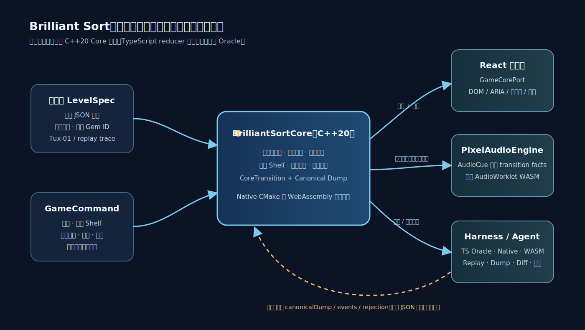

# Brilliant Sort：确定性核心、Harness 与 AI Agent 验证方案

> **对应题目**：`游戏研发基础设施 / AI Agent 方向笔试：Brilliant Sort`  
> **代码版本**：[`ed885e1`](https://github.com/cagedbird043/brilliant-sort/commit/ed885e136581c5fc13798f577717454e67671050)（2026-07-16）  
> **线上 Demo**：[Hong Kong](https://brilliant-sort.cagedbird.cn/) · [GitHub Pages](https://cagedbird043.github.io/brilliant-sort/)  
> **CI 证据**：[Actions #29484985369](https://github.com/cagedbird043/brilliant-sort/actions/runs/29484985369)（`verify`、`publish-hk`、`deploy` 全部成功）

## 摘要

本提交把 Brilliant Sort 建模为一个与 UI、动画、音频和具体引擎无关的确定性状态机。生产规则由 headless C++20 `BrilliantSortCore` 实现，并编译为浏览器 WASM；React 只经由 `GameCorePort` 消费状态转移，TypeScript reducer 仅保留为独立差分 Oracle。固定 `LevelSpec`、命令回放、canonical dump、原生/WASM 三后端差分 Harness、浏览器 E2E 与人工视觉/听觉验收共同构成可执行证据链。

题目要求的是 Demo 的核心逻辑与工程结构；仓库额外实现了一个可在线游玩的 Tux 旗舰关卡、确定性像素资产管线、独立 C++ AudioWorklet 合成器和双站静态部署。这些额外部分不改变核心论点：**规则唯一、边界可驱动、状态可序列化、失败可定位、AI 输出可验证。**

## 1. 玩法假设（8 行）

1. 每个有效棋盘格具有目标颜色，且至多容纳一颗具有独立当前颜色的宝石。
2. 宝石仅在当前颜色与目标颜色不同的时候可移动；匹配宝石永久锁定。
3. 点击可移动宝石会选择同色、可移动、八方向连通的最大分量。
4. 部分提取只允许移走边界上的安全成员，剩余选择分量必须继续八方向连通。
5. Shelf 是一个紧凑、有序、可配置容量的序列；旗舰关卡使用 16 槽，表现为两个各 8 槽的 Bank。
6. 只能把选择中的宝石放入同色且为空的目标连通分量；目标不足时保留未放置选择。
7. 所有有效格均颜色匹配、选择为空且 Shelf 为空时胜利；`apply-global-wand` 按颜色、宝石 ID 和行优先目标确定性地完成同一胜利谓词。
8. 本 Demo 没有失败、计时或步数状态；关卡由固定 JSON 提供，随机生成、商业 Power-up、LiveOps 和账号状态明确延期。

这些假设来自已归档的核心、Tux 舞台、渲染和 Demo 辅助终章规格；视频里没有出现的商业功能，也没有被擅自补成规则。

## 2. 核心状态与所有权

| 概念 | 表示 | 所有权与约束 |
| --- | --- | --- |
| `LevelSpec` | 版本化 JSON：行列、有效格、目标颜色、初始宝石、Shelf 容量 | 固定内容源；验证唯一 Gem ID、有效 mask、颜色守恒和容量 |
| `GameState` | 稀疏棋盘、Gem 映射、Shelf、选择、`Playing/Won` | 仅规则核心可以写入 |
| `BoardCell` / `Gem` | 目标颜色与宝石 ID 分离；Gem 自带颜色 | 使“正确锁定”和“错误可移动”成为导出谓词 |
| `Shelf` | 紧凑 `gemIds[]` 序列，带宽度与容量 | 移除即语义性向前压缩；两个 Bank 不会成为两个逻辑 Shelf |
| `Selection` | 来源容器、不可变 anchor、颜色、有序 Gem ID 集 | 不是复制出来的新宝石；剩余成员必须保持连通 |
| `GameCommand` | 选棋盘、选 Shelf、放入目标、放入 Shelf、取消、重开 | UI、Harness、Agent 都只通过命令驱动 |
| `CoreTransition` | 新状态、有序事件、结构化拒绝、canonical dump | 每次 `dispatch` 产生一个完整、可断言的转移 |

核心接口很小：

```ts
interface GameCorePort {
  dispatch(command: GameCommand): CoreTransition;
  snapshot(): GameState;
  restart(): CoreTransition;
  destroy(): void;
}
```

`GameCorePort` 是表现层、Harness 和 Agent 的共同边界；`canonicalDump` 稳定排序棋盘坐标、Gem ID、Shelf 序列与选择成员，因此不会混入 DOM、对象地址、动画时间或设备状态。

## 3. 模块边界与运行架构



### 规则核心

`cpp/game_core.*` 的 `BrilliantSortCore` 拥有关卡加载与验证、八方向连通、锁定判定、安全提取、目标放置、确定性全局修复、Shelf 压缩、拒绝、胜利和 canonical 序列化。它不拥有 DOM、CSS、PNG、ARIA、输入命中、动画时钟、音频时钟或布局。

这份禁区清单给代码审查一个很简单的判断办法：DOM 节点、动画进度或音频状态一旦出现在 `GameState` 里，职责就漂了，不必等到回放坏掉才发现。

C++ 对外只暴露窄 JSON v1 / C ABI；`src/wasm/game-core.ts` 把它封装为 `GameCorePort`。这样未来接入 Cocos 或其它游戏引擎时，只需替换表现适配器，不需要复制规则或改动回放协议。

### 表现、音频与规则的关系

React 根据 `CoreTransition` 渲染像素素材、无障碍语义、键盘/触摸输入、一次性提示和临时 WAAPI/SVG 动画。普通移动和魔法棒全图波次都只测量已提交状态的来源/目标矩形，弧光与三组固定像素烟花也不修改 canonical state。`PixelAudioEngine` 只消费 post-dispatch `AudioCue`；AudioContext 生命周期、设备采样率、静音偏好、音乐进度均不进入 `GameState` 或 replay。

### TypeScript 的定位

TypeScript reducer 保留为差分 Oracle，而不是浏览器生产回退。生产浏览器经 WASM 调用 C++ 核心；如果 WASM 初始化失败，应用明确失败或音频静默降级，不会偷偷切换到另一套规则引擎。

## 4. 关键规则流程

### 4.1 选择

`SelectBoardGem(coord)` 校验有效格、宝石存在和可移动性后，以八方向邻居寻找同色最大连通分量。锁定宝石、空格与异色宝石都中断路径。遍历和返回顺序稳定，避免不同后端或同一 Agent 重放出现歧义。

### 4.2 安全部分提取与 Shelf

对当前选择集合 `S`，核心只接受 `Frontier(S) ∩ SafeToRemove(S)` 中的成员；`SafeToRemove` 会重新检查 `S - {v}` 的八方向连通性。候选先按到 `selection.anchor` 的 Chebyshev 距离排序，距离相同再比较行、列。放入 Shelf 时最多取 `min(selection.size, freeSlots)` 个成员；容量不够就保留剩余选择，不会悄悄丢掉宝石。

### 4.3 放置、全局修复、拒绝与胜利

`PlaceSelectionAtTarget(coord)` 只接受同色、有效、空的目标格。核心从点击位置找出同色空目标分量，以点击格为 anchor，按 Chebyshev 距离、行、列排序；每放一颗宝石都会重新计算安全来源，再与下一个目标配对。`apply-global-wand` 保留已匹配锁定宝石，按颜色收集 Board/Shelf 中其余身份，再将字典序 Gem ID 配对到行优先同色空目标；它清空 Shelf/选择，只发出一个 `global-wand-applied` 和一个 `won`。错误目标、满 Shelf、锁定宝石和无可选宝石都返回稳定 `Rejection`，逻辑状态不变。胜利条件仍是：Shelf 空、选择空、全部有效格有宝石且颜色匹配。

## 5. Harness 与自动化验收

Harness 的设计目标不是“列出测试名称”，而是让任意固定关卡在同一协议下被加载、驱动、序列化、重放、比较和诊断：

```text
scenario.load(LevelSpec) → command.apply(GameCommand) → CoreTransition
      → before/after canonical dump + events + rejection
      → trace.replay(commandLog) → snapshot.diff(expected, actual)
```

三后端差分会逐命令比较 TypeScript Oracle、native C++ 和 WASM C++ 的 `canonicalDump`、events 与 rejection。发生分歧时，诊断包括 scenario、命令索引、命令 JSON、后端、前后状态、首个 JSON 路径差异、期望/实际 events 和 rejection，不把“失败”压缩成不可行动的一行文本。

### 必须覆盖的自动化场景

| 场景 | 初始状态与操作 | 预期结果 | 失败诊断 |
| --- | --- | --- | --- |
| 八方向选择 | 固定小棋盘，斜对角同色可动宝石，夹有锁定/异色屏障；点击起点 | 仅返回同色可动八连通分量，起点第一，稳定 BFS 顺序 | 起点、返回坐标、期望与实际顺序、错误屏障路径 |
| 部分入 Shelf 与压缩 | 选择大于剩余容量的分量，再从 Shelf 放回目标 | 仅安全成员进入 Shelf；剩余选择连通；移除后 row-major 紧凑 | Shelf 序列、剩余 component、容量、首个不连通点 |
| 拒绝不变性 | 点击锁定/空格/错误颜色目标/满 Shelf | 收到指定 `Rejection`，状态 dump 保持字节相同 | 命令、rejection code、before/after dump 的首个差异 |
| `tux-01` 胜利回放 | 24×32、546 有效格、16 槽 Shelf；回放提交的 48 条命令 | 三后端逐 transition 一致，最终 `Won`、Shelf 空、546 格匹配 | command index、backend、前后 dump、events、rejection、首个 JSON 路径 |
| `tux-01` 全局修复 | 分别从初始状态和 Shelf 已占用的中途状态发送 `apply-global-wand` | 锁定身份不动、136 个可移动身份守恒、Shelf/选择清空；三后端 canonical dump 一致，事件严格为聚合事件后接 `won` | backend、事件序列、首个 identity/location 或 canonical JSON 差异 |

`src/harness/differential.ts` 让这套诊断成为真实实现，而不是设计口号；`bun run harness differential tux-01` 可重放旗舰关卡的三后端证明。

## 6. AI Agent 的使用与验证

### 让 Agent 做什么

Agent 可承担限定范围内的模块拆解、接口审查、实现、测试补充、审查生成的像素资产、读取差分日志和提出修复。它不应自行发明未观察到的商业规则、随机模式或支付流程；内置魔法棒则是经规格化、三后端验证的确定性 Demo 辅助，不是商业 Power-up。

### 给 Agent 的上下文与可执行反馈

已归档和活动中的 OpenSpec 提供题目事实、假设、非目标、模块边界、接受标准和人工验收门。`src/agent/context.ts` 会拒绝请求中包含明确延期的能力；`src/agent/audit.ts` 将规格版本、改动文件、验证命令、验证结果、下一决策和时间戳序列化为审计记录。

[`tests/agent/context.test.ts`](tests/agent/context.test.ts) 里的 `deferred capability requests stop before speculative implementation` 会把含有 `power-up` 和 `payment` 的请求交给上下文构造器，并断言结果为 `blocked`。也就是说，越界请求在生成实现方案之前就会停住。

Agent 的可执行反馈不是自然语言“看起来不对”，而是：固定 fixture、命令日志、canonical dump、事件、rejection、Harness 首个 JSON 差异、原生/WASM 差分、浏览器 E2E 以及人工视觉/听觉 review。

### 一个容易误解的边界与发现方式

**规则误解**：两个视觉 Shelf Bank 很容易诱导 Agent 实现成两个独立逻辑容器。规格明确规定核心仅有一个紧凑 `Shelf.gemIds` 序列，A/B 只是在表现层按索引 `0..7` 与 `8..15` 切片；否则追加顺序、部分提取和压缩都会产生错误。固定 Shelf 回放和 canonical dump 会立即暴露这种偏差。

**表现误解（实际修复案例）**：初版飞行克隆只平移，Large Shelf 宝石抵达 Micro 棋盘格时会突然换图。规则差分不会发现该问题；浏览器中帧和 E2E 则要求来源/终点矩形对齐、一个可见表示、双向 `translate + scale`、Large/Micro 离散 LOD 交接和动画结束后才解锁输入。该修复说明“逻辑测试通过”不等于“产品表现合格”。

## 7. C++ 小型代码题

题目要求的 `FindConnectedMovableGems` 位于：[`cpp/connected_gems.hpp`](cpp/connected_gems.hpp) 与 [`cpp/connected_gems.cpp`](cpp/connected_gems.cpp)。它采用 BFS，稳定邻居次序为 `N, NE, E, SE, S, SW, W, NW`：

```cpp
std::vector<std::pair<int, int>> FindConnectedMovableGems(
    const std::vector<std::vector<GemCell>>& board,
    int startRow,
    int startCol);
```

- 越界、空宝石或不可动起点返回空。
- 入队时标记 visited，确保不重复返回。
- 仅扩展与起点同色且可动的八方向邻居。
- 返回顺序是起点在前的 BFS 发现顺序。
- 对已发现网格的时间与辅助空间复杂度均为 $O(V)$。

下面两个 $3 \times 3$ 例子把输入和返回顺序直接列出来。`R` 表示颜色为 1 且可移动的宝石，`.` 表示空格。

```text
例 1：start = (0, 0)          例 2：start = (1, 1)

R . .                         . R .
. R .                         . R R
. . R                         . . R

返回 [(0,0),(1,1),(2,2)]      返回 [(1,1),(0,1),(1,2),(2,2)]
```

[`cpp/connected_gems_test.cpp`](cpp/connected_gems_test.cpp) 还覆盖锁定/异色屏障、无效起点和输入不变性。

如果把这个函数扩展成“放置优先级”，目标颜色先筛出可用目标，Shelf 剩余容量或目标数量决定本轮最多移动几颗。来源取 `Frontier(S) ∩ SafeToRemove(S)`，目标取点击位置所在的同色空分量；两边都按 anchor 的 Chebyshev 距离、行、列排序，然后依次配对。每移动一颗都要重新计算安全来源；来源在 Shelf 时，还要按压缩后的坐标复查剩余选择是否连通。这样拓扑搜索只回答“哪些格连着”，放置规则负责“先搬谁、放哪里”。

## 8. 扩展边界

| 易于扩展 | 需要协议升级或重构 |
| --- | --- |
| 新固定关卡、颜色、像素素材、音效/音乐、Harness 场景；全后端同步的加法型确定性命令 | 破坏现有命令形状、多个逻辑 Shelf、失败/计时状态、商业 Power-up 改变占用规则 |
| 新 React/Cocos 表现适配器、更多无障碍展示、纯表现动画 | 运行时随机生成进入 replay、持久化档案/货币、联机或非确定性物理 |
| 新的 fixture 验证器与赢局 trace | `LevelSpec` 语义版本变更、JSON ABI 破坏性改动、跨平台协议迁移 |

这一区分避免把“可换表现层”误当作“任何规则都可零成本加进去”。新增规则必须同步更新核心规格、夹具验证器、replay 基线、Harness 断言、C++/WASM 协议和 Agent 约束。

## 9. 复现与证据

```bash
bun install --frozen-lockfile
bun run check
bun run test:e2e
bun run harness replay tux-01
bun run harness differential tux-01
bun run level:check:tux
```

作为复现成本参考，[GitHub Actions run #29484985369](https://github.com/cagedbird043/brilliant-sort/actions/runs/29484985369) 的 `verify` 在 Ubuntu runner 上用时 1 分 46 秒，其中包括安装固定版本的 Emscripten 和 Chromium、编译三个后端并运行全部自动化检查。本地已有依赖和浏览器缓存时通常更快；第一次运行主要看下载速度。

对应版本的本地验证包括 34 个 Bun 测试、4 个 native CTest（含固定 48 kHz PCM 哈希）、22 次 desktop/mobile Chromium E2E，以及 48 命令 Tux 与初始/中途魔法棒场景的三后端逐 transition parity。最新 CI 在 Ubuntu 上重新执行类型检查、native C++、WASM 构建、Bun 测试、CTest、Chromium E2E、Hong Kong 静态产物和 GitHub Pages 部署。

详细的“题目要求 → 设计 → 代码 → 测试/线上证据”索引见：[`submission/evidence-matrix.md`](submission/evidence-matrix.md)。OpenSpec 是本答卷的需求来源与验收记录，不是另写一套事后叙事；以下规格均已通过自动验证与人工产品验收并归档：

- [`2026-07-15-add-brilliant-sort-core`](openspec/changes/archive/2026-07-15-add-brilliant-sort-core/)
- [`2026-07-16-add-pixel-crystal-renderer`](openspec/changes/archive/2026-07-16-add-pixel-crystal-renderer/)
- [`2026-07-16-rebuild-tux-mosaic-stage`](openspec/changes/archive/2026-07-16-rebuild-tux-mosaic-stage/)
- [`2026-07-16-add-cpp-pixel-audio-engine`](openspec/changes/archive/2026-07-16-add-cpp-pixel-audio-engine/)
- [`2026-07-16-add-demo-assist-and-victory-finale`](openspec/changes/archive/2026-07-16-add-demo-assist-and-victory-finale/)

## 结论

该方案的交付重点不是一张可玩的截图，而是把复杂度收敛到可验证边界：一个可替换表现层的规则核心、一套可重放/可比较/可诊断的状态协议、一条能约束 AI 输出的验收闭环，以及可独立编译验证的 C++ 连通算法。在线 Tux Demo、像素资产和确定性音频证明这些边界能够承载真实产品表现，但它们不替代核心工程证据。
